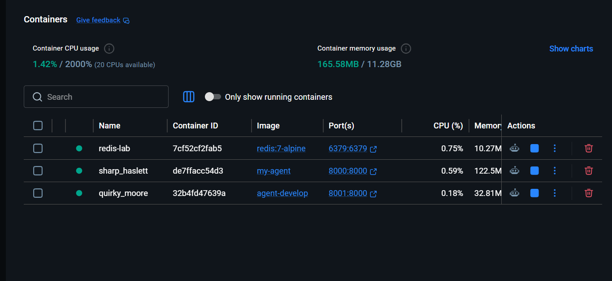

#  Delivery Checklist — Day 12 Lab Submission

> **Student Name:**Lương Thanh Hậu  
> **Student ID:** 2A202600115
> **Date:** 17/04/2026
---

##  Submission Requirements

Submit a **GitHub repository** containing:

### 1. Mission Answers (40 points)

Create a file `MISSION_ANSWERS.md` with your answers to all exercises:

# Day 12 Lab - Mission Answers

## Part 1: Localhost vs Production

### Exercise 1.1: Anti-patterns found

1. **Hardcoded secrets trong code**  
   `develop/app.py` đặt API key trực tiếp trong source (`OPENAI_API_KEY = "sk-hardcoded-demo-key"`), dễ lộ key khi push GitHub.

2. **Hardcoded hạ tầng (DB URL) trong code**  
   `DATABASE_URL` bị cứng trong file, khó đổi theo môi trường dev/staging/prod.

3. **Không có config management chuẩn**  
   `DEBUG`, `MAX_TOKENS` được gán cứng (`True`, `500`) thay vì quản lý tập trung từ environment/config object.

4. **Log lộ thông tin nhạy cảm**  
   Có `print` key (`print(f"[DEBUG] Using key: {OPENAI_API_KEY}")`) nên có rủi ro bảo mật nghiêm trọng.

5. **Không có health/readiness endpoint**  
   Bản develop không có `GET /health`, `GET /ready`, khiến cloud platform khó kiểm tra trạng thái sống/sẵn sàng.

6. **Bind host chỉ localhost**  
   `host="localhost"` làm app chỉ truy cập được trên máy local, không phù hợp container/cloud.

7. **Port hardcode**  
   `port=8000` không đọc từ biến `PORT`, dễ lỗi khi deploy trên platform inject port động.

8. **Reload/debug mode bật cứng**  
   `reload=True` không phù hợp production (tốn tài nguyên và hành vi không ổn định khi scale).

### Exercise 1.3: Comparison table

| Feature | Develop (❌) | Production (✅) | Why Important? |
|---------|--------------|----------------|----------------|
| Config | Hardcode trực tiếp trong `app.py` | Tập trung ở `config.py`, đọc từ env | Dễ đổi theo môi trường, đúng 12-factor |
| Secrets | Có key cứng trong code, còn log ra màn hình | Đọc từ env (`OPENAI_API_KEY`, `AGENT_API_KEY`) | Tránh lộ secrets, an toàn khi public repo |
| Port/Host | `localhost:8000` hardcode | `HOST` + `PORT` từ env (mặc định `0.0.0.0`) | Chạy được trên Docker/Railway/Render |
| Logging | `print()` tự do, không chuẩn hóa | Structured JSON logging (`logging` + `json`) | Dễ quan sát/trace trên hệ thống log tập trung |
| Health checks | Không có | Có `GET /health` và `GET /ready` | Platform dùng để restart/routing đúng |
| Request handling | `/ask` đơn giản, thiếu guardrails | Validate input + log chuẩn | Giảm lỗi runtime, dễ debug |
| Shutdown behavior | Không xử lý vòng đời rõ ràng | Có lifespan + xử lý SIGTERM graceful | Tránh rớt request khi scale down/redeploy |
| Cloud readiness | "Works on my machine" | Thiết kế sẵn cho production | Đảm bảo deploy ổn định, dễ mở rộng |

## Part 2: Docker

### Exercise 2.1: Dockerfile questions
1. Base image:
   - Develop: `python:3.11`
   - Production-ready (`06-lab-complete`): `python:3.11-slim` (multi-stage)
2. Working directory: `/app` (runtime container)
3. Why copy `requirements.txt` before app source:
   - Tận dụng Docker layer cache, giúp build lại nhanh khi chỉ đổi code.
4. Why multi-stage build is better:
   - Giảm kích thước image, giảm bề mặt tấn công, deploy nhanh hơn.
5. Runtime command:
   - Develop: `CMD ["python", "app.py"]`
   - Production-ready: `CMD ["uvicorn", "app.main:app", "--host", "0.0.0.0", "--port", "8000", "--workers", "2"]`

### Exercise 2.3: Image size comparison
- Develop: `1660 MB` (`agent-develop`)
- Production: `279 MB` (`my-agent`)
- Difference: `~83.2%` smaller (`(1660 - 279) / 1660`)
- Size ratio: production chỉ khoảng `16.8%` so với develop

### Docker runtime screenshot



Ghi chú từ ảnh:
- `my-agent` đang chạy map port `8000:8000` (dành cho production-ready app)
- `agent-develop` đang chạy map port `8001:8000` (tránh conflict với `my-agent`)
- `redis-lab` đang chạy map port `6379:6379` (state backend cho rate limit/cost/history)

### Exercise 2.4: Build/Run verification
- Build `agent-develop`: ✅ success
- Build `my-agent`: ✅ success
- Run `my-agent` on `8000:8000`: ✅ success
- Run `agent-develop` on `8001:8000`: ✅ success
- Health check log (`GET /health`): ✅ trả về `200 OK` nhiều lần (theo terminal output)

## Part 3: Cloud Deployment

### Exercise 3.1: Render deployment
- Platform selected: **Render** (primary), **Railway** (backup config)
- Deployment config prepared:
  - `06-lab-complete/render.yaml`
- URL: **Pending final Render deploy (Blueprint)**
- Screenshot: **Pending** (cần chụp dashboard + service running sau khi có URL)
- Documentation file: ✅ `DEPLOYMENT.md` created in project root

## Part 4: API Security

### Exercise 4.1-4.3: Test results
- API key authentication: ✅ implemented trong `06-lab-complete/app/auth.py`
- Rate limiting: ✅ implemented trong `06-lab-complete/app/rate_limiter.py` (10 req/min)
- Token flow (`/auth/token` + bearer `/ask`): ✅ implemented, cần chụp output test để nộp

### Exercise 4.4: Cost guard implementation
- Implemented trong `06-lab-complete/app/cost_guard.py`.
- Cơ chế: theo dõi usage theo user trong Redis và chặn khi vượt `MONTHLY_BUDGET_USD` (mặc định `$10`).
- Tích hợp dưới dạng dependency ở endpoint `/ask` để chặn request trước khi gọi LLM.

## Part 5: Scaling & Reliability

### Exercise 5.1-5.5: Implementation notes
- Health check: ✅ `GET /health`
- Readiness check: ✅ `GET /ready` (kèm kiểm tra Redis ping)
- Graceful shutdown: ✅ có xử lý SIGTERM/SIGINT
- Stateless design: ✅ conversation history/rate/budget state lưu Redis
- Structured logging: ✅ JSON logs cho startup/request/shutdown

---

### Status note
- `06-lab-complete/check_production_ready.py`: **20/20 checks passed (100%)**
- Còn thiếu để nộp hoàn chỉnh: `DEPLOYMENT.md`, public URL, screenshots deploy.

---

### 2. Full Source Code - Lab 06 Complete (60 points)

Your final production-ready agent with all files:

```
your-repo/
├── app/
│   ├── main.py              # Main application
│   ├── config.py            # Configuration
│   ├── auth.py              # Authentication
│   ├── rate_limiter.py      # Rate limiting
│   └── cost_guard.py        # Cost protection
├── utils/
│   └── mock_llm.py          # Mock LLM (provided)
├── Dockerfile               # Multi-stage build
├── docker-compose.yml       # Full stack
├── requirements.txt         # Dependencies
├── .env.example             # Environment template
├── .dockerignore            # Docker ignore
├── railway.toml             # Railway config (or render.yaml)
└── README.md                # Setup instructions
```

**Requirements:**
-  All code runs without errors
-  Multi-stage Dockerfile (image < 500 MB)
-  API key authentication
-  Rate limiting (10 req/min)
-  Cost guard ($10/month)
-  Health + readiness checks
-  Graceful shutdown
-  Stateless design (Redis)
-  No hardcoded secrets

---

### 3. Service Domain Link

Create a file `DEPLOYMENT.md` with your deployed service information:

```markdown
# Deployment Information

## Public URL
https://your-agent.railway.app

## Platform
Railway / Render / Cloud Run

## Test Commands

### Health Check
```bash
curl https://your-agent.railway.app/health
# Expected: {"status": "ok"}
```

### API Test (with authentication)
```bash
curl -X POST https://your-agent.railway.app/ask \
  -H "X-API-Key: YOUR_KEY" \
  -H "Content-Type: application/json" \
  -d '{"user_id": "test", "question": "Hello"}'
```

## Environment Variables Set
- PORT
- REDIS_URL
- AGENT_API_KEY
- LOG_LEVEL

## Screenshots
- [Deployment dashboard](screenshots/dashboard.png)
- [Service running](screenshots/running.png)
- [Test results](screenshots/test.png)
```

##  Pre-Submission Checklist

- [ ] Repository is public (or instructor has access)
- [x] `MISSION_ANSWERS.md` created and filled for Part 1 + Part 2
- [ ] `MISSION_ANSWERS.md` completed with all exercises (Part 3-5 still need final write-up)
- [ ] `DEPLOYMENT.md` has working public URL
- [x] All source code in `app/` directory (`06-lab-complete/app/`)
- [x] `README.md` has setup instructions
- [x] No `.env` file committed (using `.env.example`)
- [x] No hardcoded secrets in `06-lab-complete/app/` production code
- [ ] Public URL is accessible and working
- [ ] Screenshots included in `screenshots/` folder
- [x] Repository has commit history

---

##  Self-Test

Before submitting, verify your deployment:

```bash
# 1. Health check
curl https://your-app.railway.app/health

# 2. Authentication required
curl https://your-app.railway.app/ask
# Should return 401

# 3. With API key works
curl -H "X-API-Key: YOUR_KEY" https://your-app.railway.app/ask \
  -X POST -d '{"user_id":"test","question":"Hello"}'
# Should return 200

# 4. Rate limiting
for i in {1..15}; do 
  curl -H "X-API-Key: YOUR_KEY" https://your-app.railway.app/ask \
    -X POST -d '{"user_id":"test","question":"test"}'; 
done
# Should eventually return 429
```

---

##  Submission

**Submit your GitHub repository URL:**

```
https://github.com/<your-username>/day12-agent-deployment
```

**Deadline:** 17/4/2026

---

##  Quick Tips

1.  Test your public URL from a different device
2.  Make sure repository is public or instructor has access
3.  Include screenshots of working deployment
4.  Write clear commit messages
5.  Test all commands in DEPLOYMENT.md work
6.  No secrets in code or commit history

---

##  Need Help?

- Check [TROUBLESHOOTING.md](TROUBLESHOOTING.md)
- Review [CODE_LAB.md](CODE_LAB.md)
- Ask in office hours
- Post in discussion forum

---

**Good luck! **
